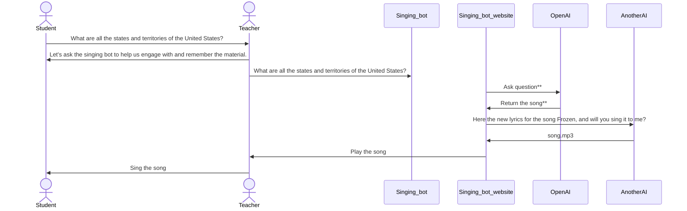

# singing-bot

## Introduction
Welcome to the future of learning! The ChatGPT Q&A to Song Translator is an innovative project designed to ignite the curiosity of young minds while making the learning process fun and memorable. In the fast-paced world of today, it's essential to harness technology's power to ensure that kids remain engaged and interested in learning. Our mission is to create a bridge between traditional education and modern technology, helping students of all ages explore knowledge in a playful and interactive way.

## Project Description
Our FLL Robotics project centers on the development of a program that allows users to ask questions on any topic. What makes this project unique is its ability to take those questions and transform them into catchy songs. The program leverages ChatGPT, a state-of-the-art language model, to convert plain questions into fun and memorable tunes. By doing so, we aim to achieve two primary objectives:

Sustained Interest in Learning: Music is a universal language that resonates with people of all ages. By turning questions into songs, we hope to foster a sense of joy and excitement around learning. This, in turn, can help children stay engaged with their studies.

Enhanced Memory Retention: Music has a remarkable impact on memory. By creating songs from questions, we believe that the information becomes easier to remember. This can be particularly useful for studying and retaining educational content.


## How It Works
Ask a Question: Users type their questions into the program.

Genre Selection: Users choose the style of song they want the answer to be transformed into.

Song Generation: The program uses ChatGPT to translate the question into lyrics and music, producing a fun and educational song.

Enjoy and Learn: Users can listen to their custom-made songs, reinforcing their understanding of the topic.



Example of questions: 
```
write me the lyric that list all the states and territories of united state the rhyme with the song frozen
```

Example of answered from the above questions
```
(Verse 1)
The states are wide, a land so great, it's true,
From Alabama to Wyoming, it's a splendid view.
California's sun, the New York groove,
A nation united, there's nothin' we can't prove.

(Chorus)
Let it flow, let it flow,
In the U.S. we all know,
We've got fifty states, and territories too,
In this land, our dreams come true.

(Verse 2)
Texas skies, and the Florida sun,
Alaska's wild, where the bears do run.
Hawaii's breeze, so gentle and warm,
Together we weather every storm.

(Chorus)
Let it flow, let it flow,
In the U.S. we all know,
We've got fifty states, and territories too,
In this land, our dreams come true.

```

    
## For Local Developments
1. run below command to install all dependencies  
```
pip install  singing-bot/requirement.txt
``` 
2. run below command to start up Flask server 
```
python routing_question.py 
```
3. Install HTML Previewer then open as preview in the browser to start testing the code
